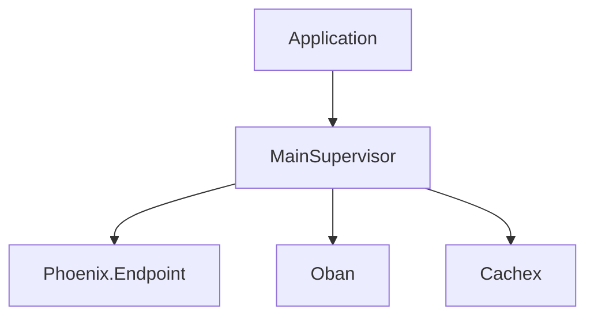

# Code-to-Diagram Patterns

These patterns illustrate principles for diagramming real
codebases. Consider what fits your specific context.

## Contents
- General approach
- Elixir / Phoenix / OTP
- Spring Boot / Java
- FastAPI / Python
- React / TypeScript
- Node.js / Express
- Data pipelines

---

## General approach

1. **Read before drawing** — always read the actual source.
   Never fabricate module names, function signatures, or
   relationships from assumptions
2. **Identify the pattern** — MVC, hexagonal, pipeline,
   event-driven, actor model, pub/sub
3. **Pick the right aspect** — one diagram shows one thing.
   Don't combine data model with request flow
4. **Use real names** — node labels should match actual
   module/function/table names from the code

---

## Elixir / Phoenix / OTP

**Phoenix request flow** → `sequenceDiagram`
```
Router → Controller → Context → Repo → Database
```

**Supervision tree** → `graph TD`


**GenServer state machine** → `stateDiagram-v2`
```
Map GenServer states and handle_call/handle_cast transitions
```

**Ecto schema relationships** → `erDiagram`
```
Map has_many, belongs_to, many_to_many associations
```

**PubSub event flow** → `sequenceDiagram`
```
LiveView → PubSub.broadcast → Other LiveViews
```

**Oban job pipeline** → `graph LR`
```
Event → Oban.insert → Worker.perform → Side effects
```

---

## Spring Boot / Java

**Controller → Service → Repository** → `sequenceDiagram`
```
REST Controller → Service → JPA Repository → Database
```

**Bean dependency graph** → `graph TD`
```
Map @Autowired / constructor injection dependencies
```

**Event-driven with Spring Events** → `sequenceDiagram`
```
Publisher → ApplicationEventPublisher → @EventListener
```

---

## FastAPI / Python

**Request lifecycle** → `sequenceDiagram`
```
Client → Middleware → Dependency → Route → Response
```

**Dependency injection tree** → `graph TD`
```
Map Depends() chains from routes to services to repos
```

**Pydantic model hierarchy** → `classDiagram`
```
Map BaseModel inheritance and field types
```

---

## React / TypeScript

**Component tree** → `graph TD`
```
App → Layout → Page → Components (max 3 levels)
```

**State flow** → `graph LR`
```
User Action → Dispatch → Reducer → Store → Component
```

**Data fetching** → `sequenceDiagram`
```
Component → Hook → API Client → Backend → Response
```

---

## Node.js / Express

**Middleware pipeline** → `graph LR`
```
Request → Auth → Validation → Handler → Response
```

**Event-driven architecture** → `sequenceDiagram`
```
Producer → EventEmitter → Consumer handlers
```

---

## Data pipelines

**ETL flow** → `graph LR`
```
Source → Extract → Transform → Load → Destination
```

**Streaming architecture** → `graph LR`
```
Producer → Kafka/SQS → Consumer → Processing → Store
```

**Broadway pipeline** → `graph LR`
```
Producer → Processors (batched) → Batcher → Handler
```

---

## Anti-patterns in code diagrams

- **Fabricated names** — inventing module names not in the
  codebase. Always verify with file reads
- **Too much detail** — showing every function call. Focus
  on the architectural story
- **Missing evidence** — nodes labeled "Service" or
  "Handler" instead of `BookingContext` or
  `PaymentWorker`. Use real names
- **Wrong abstraction level** — mixing infrastructure
  (Kubernetes pods) with application logic (controllers)
  in one diagram
- **Outdated structure** — diagramming what the code
  looked like before a refactor. Always read current files
