# Diagram Types Reference

## Contents
- Flowchart / Graph
- Sequence Diagram
- State Diagram
- Entity Relationship Diagram
- Class Diagram
- Gantt Chart
- Pie Chart
- Git Graph
- Mindmap
- Timeline
- User Journey
- XY Chart
- Block Diagram
- C4 Diagrams
- Quadrant Chart
- Requirement Diagram
- Architecture Diagram
- Kanban

---

## Flowchart / Graph

Best for: component relationships, data flows, decision
trees, process flows.

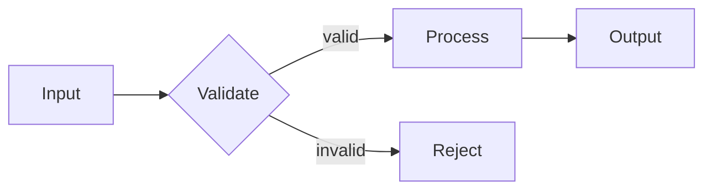

**Direction options:** `TD` (top-down), `LR` (left-right),
`BT` (bottom-up), `RL` (right-left).

**Node shapes:**
- `[text]` — rectangle
- `(text)` — rounded rectangle
- `{text}` — diamond (decision)
- `([text])` — stadium
- `[[text]]` — subroutine
- `[(text)]` — cylinder (database)
- `((text))` — circle
- `>text]` — asymmetric
- `{{text}}` — hexagon

**Edge styles:**
- `-->` solid arrow
- `-.->` dotted arrow
- `==>` thick arrow
- `-- text -->` labeled edge
- `~~~` invisible link (layout control)

**Subgraphs** for grouping:
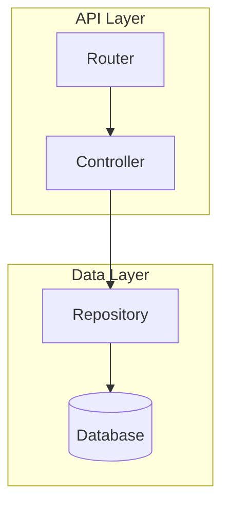

**Layout patterns:**
- Hub-and-spoke: central node with radiating connections
- Swimlane: parallel subgraphs for different actors
- Pipeline: linear flow with stages
- Feedback loop: circular flow with return edges

---

## Sequence Diagram

Best for: request/response, API calls, authentication
flows, message passing between actors.

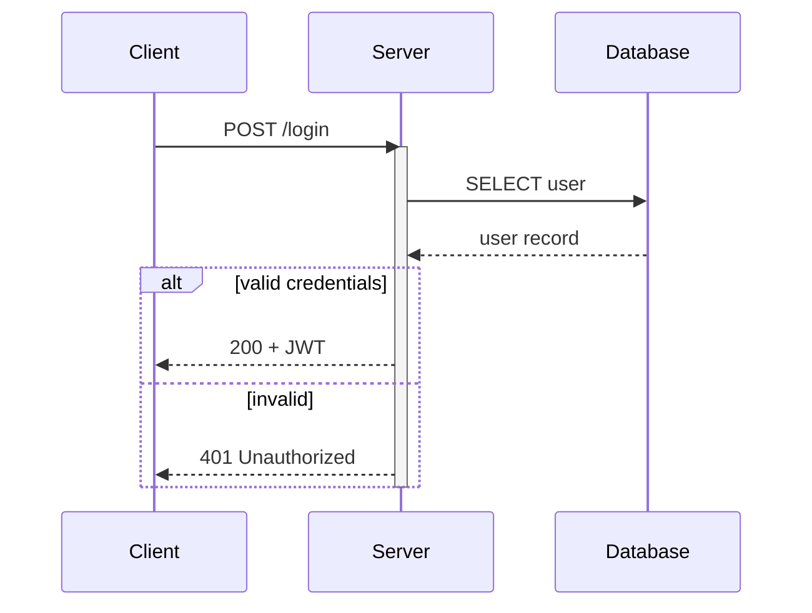

**Arrow types:**
- `->>` solid with arrowhead
- `-->>` dashed with arrowhead
- `-x` solid with cross (async)
- `--x` dashed with cross

**Blocks:** `alt/else/end`, `opt/end`, `loop/end`,
`par/and/end`, `critical/option/end`, `break/end`.

**Notes:** `Note over A,B: text` or `Note right of A: text`

**Semicolons in messages** require HTML entity: `#59;`

---

## State Diagram

Best for: lifecycle, modes, status transitions.

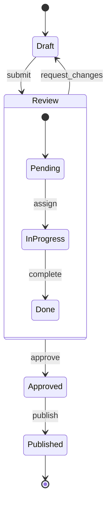

Use `stateDiagram-v2` (not `stateDiagram`).
`[*]` marks start/end states. Nested states via
`state Name { }`.

---

## Entity Relationship Diagram

Best for: database schemas, data models, associations.

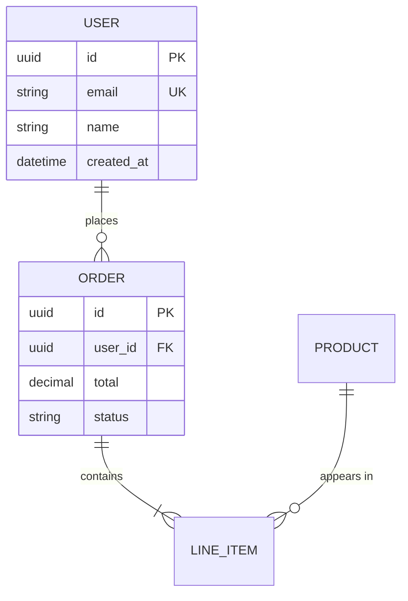

**Cardinality:** `||` exactly one, `o|` zero or one,
`}|` one or more, `}o` zero or more.

---

## Class Diagram

Best for: OOP structures, module interfaces, type
hierarchies.

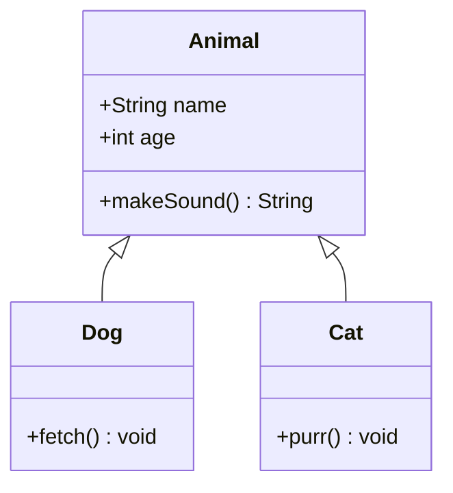

**Relationships:** `<|--` inheritance, `*--` composition,
`o--` aggregation, `-->` association, `..>` dependency.

**Visibility:** `+` public, `-` private, `#` protected,
`~` package.

---

## Gantt Chart

Best for: project timelines, sprint planning, milestones.

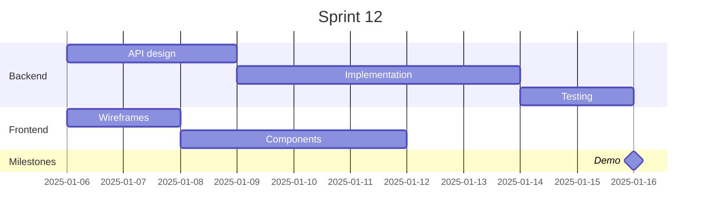

---

## Pie Chart

Best for: proportions, distributions, breakdowns.

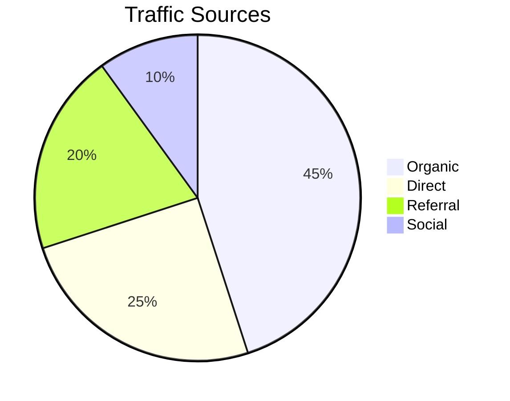

---

## Git Graph

Best for: branching strategies, release flows.

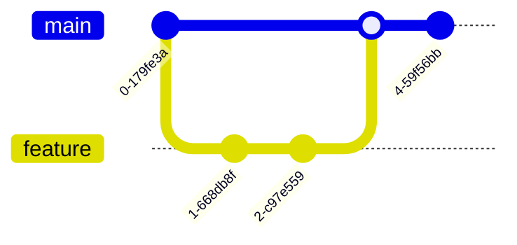

---

## Mindmap

Best for: brainstorming, concept hierarchies, topic
exploration.

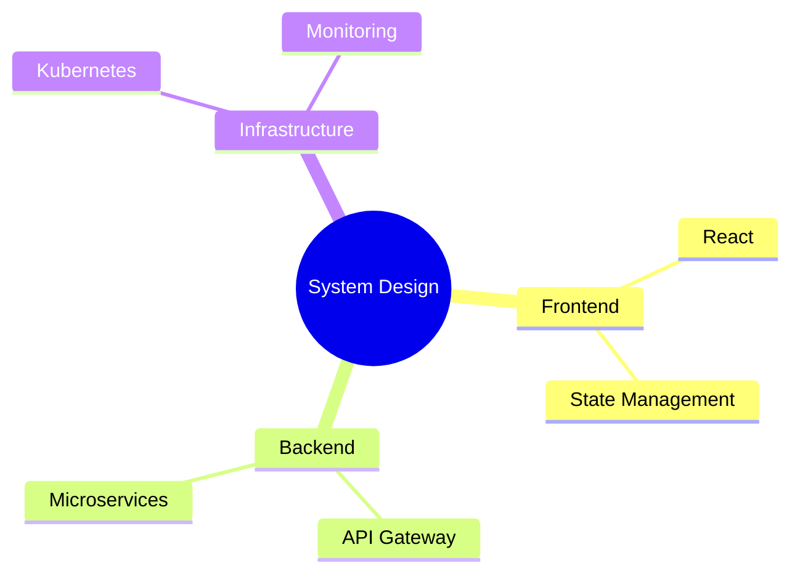

---

## Timeline

Best for: chronological events, project history.

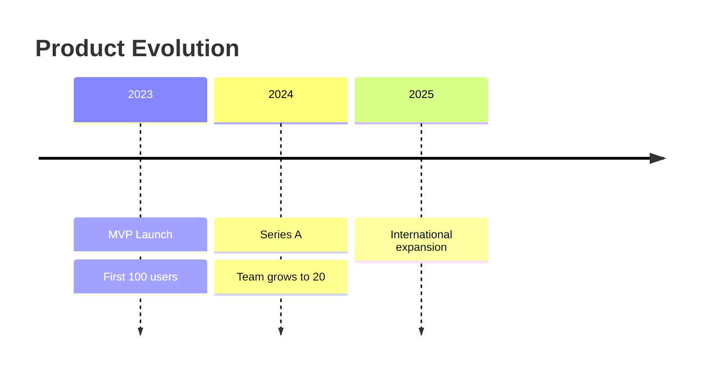

---

## User Journey

Best for: user experience flows, satisfaction mapping.

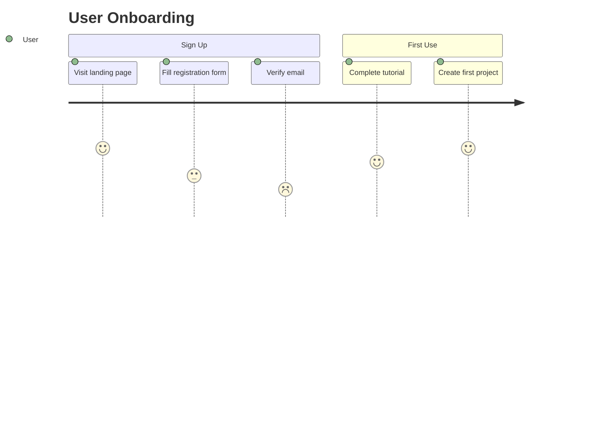

Numbers represent satisfaction (1-5).

---

## XY Chart

Best for: metrics, trends, comparisons over axes.

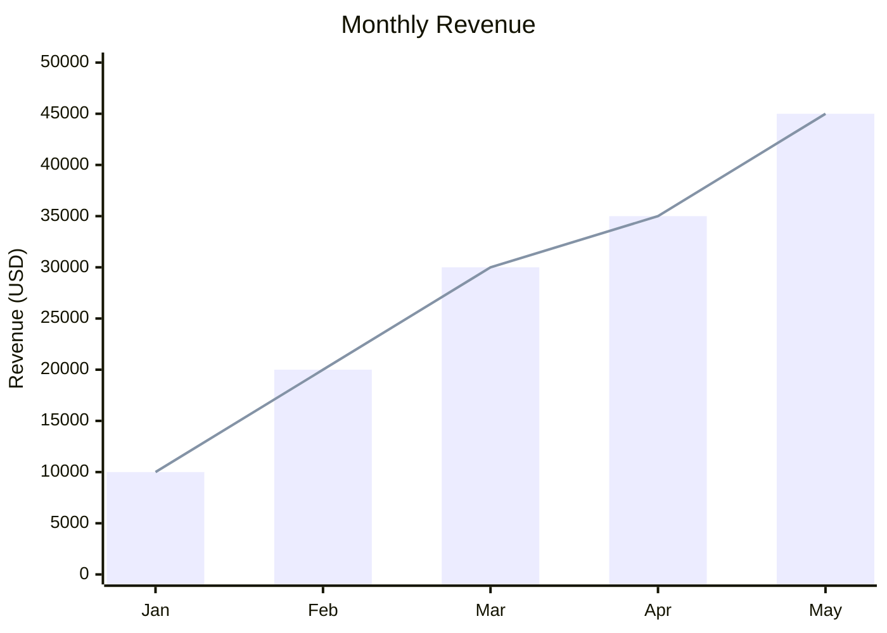

---

## Block Diagram

Best for: nested containers, system architecture layers.

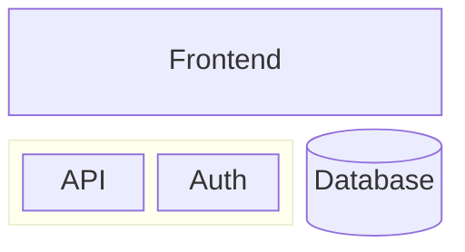

---

## C4 Diagrams

Best for: system context, container, and component views
following the C4 model.

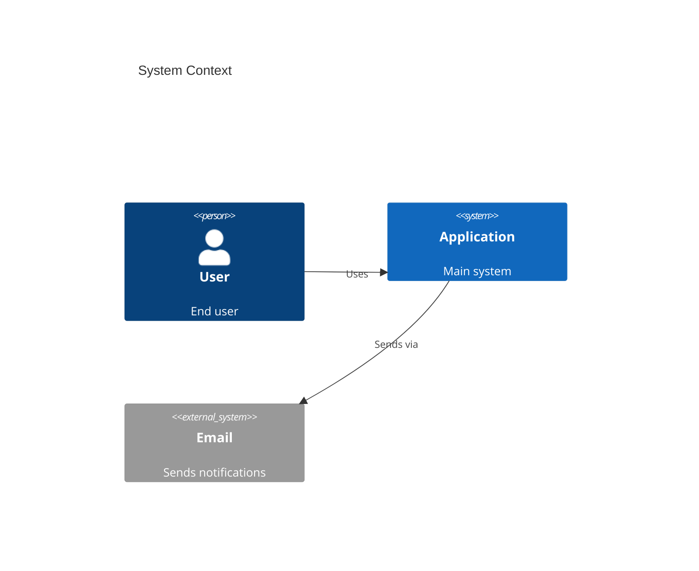

Variants: `C4Context`, `C4Container`, `C4Component`,
`C4Deployment`.

---

## Quadrant Chart

Best for: priority matrices, risk assessment, strategic
positioning.

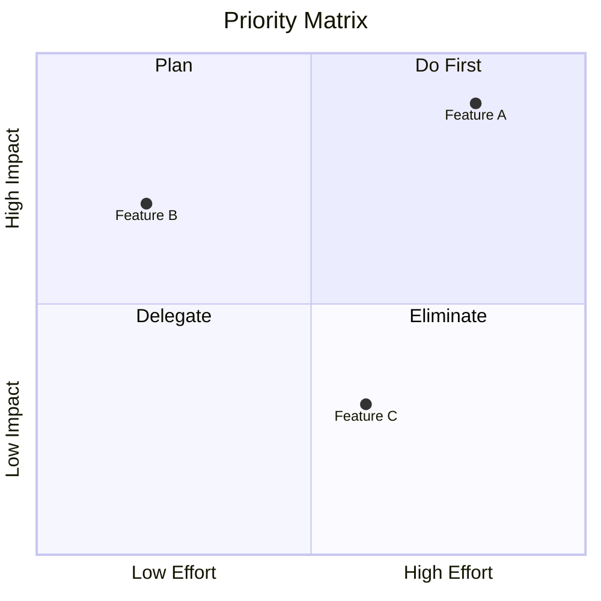

---

## Requirement Diagram

Best for: traceability, compliance, specification mapping.

```mermaid
requirementDiagram
    requirement authReq {
        id: REQ-001
        text: System shall authenticate users
        risk: high
        verifymethod: test
    }
    element authModule {
        type: module
        docref: auth.ex
    }
    authModule - satisfies -> authReq
```

---

## Architecture Diagram

Best for: infrastructure, deployment topology.

Note: `architecture-beta` syntax. May not be available in
all Mermaid versions.

---

## Kanban

Best for: task boards, work-in-progress tracking.

Note: `kanban` syntax. Available in Mermaid v11+.
